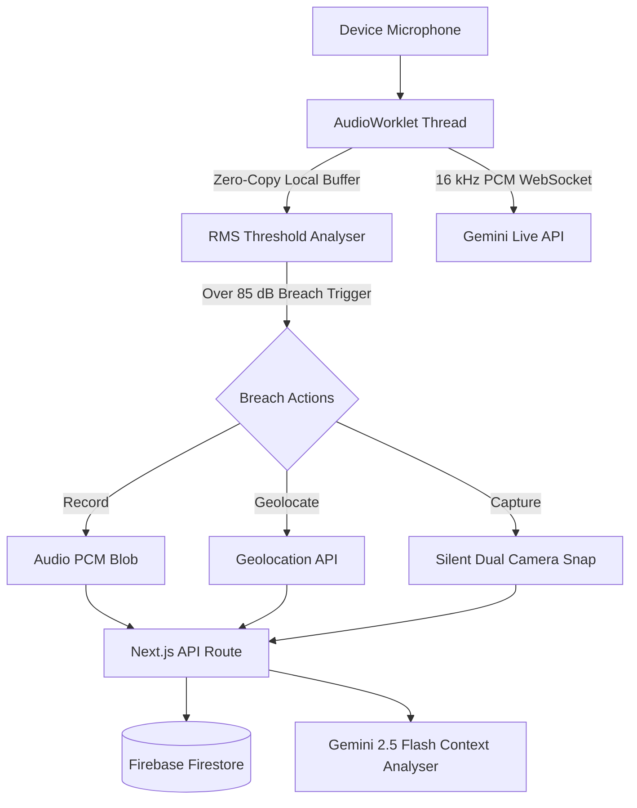

<div align="center">
  <h1 align="center">Aegis - AI Acoustic Safety Guardian</h1>
  <p align="center">
    <strong>"Silence is not always safe. Aegis listens when no one else can."</strong>
    <br/>
    <br/>
    <a href="https://aegis-weather.web.app/" target="_blank">View Live Demo</a>
    ·
    <a href="https://github.com/frankmathewsajan/qualie/issues" target="_blank">Report a Bug</a>
  </p>

  <p align="center">
    
    
    
    
    
  </p>
</div>

---

Aegis is a real-time, **AI-powered ambient audio safety system** designed to recognize distress natively, intelligently, and respectfully. It continuously monitors an environment through the device microphone using a powerful combination of **Web Audio APIs** for local edge detection and **Google Gemini's Multimodal Live API** for instantaneous contextual incident analysis.

The moment acoustic stress exceeds a safety threshold, Aegis securely dispatches context-aware, structured threat intelligence — transforming the device into an active guardian with sub-30ms reaction latency.

## Key Features

### Core Safety Systems
- **Edge Acoustic Monitoring**: Near-zero latency threshold analysis using **Web Audio API** and a custom isolated `AudioWorklet`. No cloud processing overhead, no idle API costs.
- **Multimodal AI Fallback**: Integrates natively with the **Google Gemini 2.5 Flash Native Audio API** to interpret raw sound data (like distinguishing a genuine cry for help from a loud TV).
- **Stealth Mode UI**: A double-tap disguised lock screen interface that completely conceals the application's active monitoring state.
- **Silent Camera Burst**: Automatically and silently captures front and rear uncompressed photography directly triggered upon a breach. 
- **Context-Aware Analytics**: Injects high-accuracy **Open-Meteo** weather telemetry and live Geolocation to prevent false positives (e.g. thunder strikes vs. structural impacts).

### Emergency Dispatch & Tracking
- **WhatsApp SOS Integration**: Fallback emergency contact routing capable of blasting automated, pre-typed deep-link distress beacons (`wa.me`) bypassing restrictive mobile browser popup constraints.
- **Live Guardian Dashboard**: Secure, session-based continuous location tracking routes utilizing **Firebase Firestore** as an active dead-man switch updating position every 5 seconds.
- **Operator Push-To-Talk Voice of God**: PWA Service Worker push-notifications via **Web-Push & Firebase Cloud Messaging** empowering emergency dispatch operators to directly ping the device with audio commands or silent textual alerts even if the screen is locked.

---

## System Architecture

Aegis utilizes a dual-pipeline routing architecture to maximize reaction speed while preserving deep AI capabilities:



### The PWA App Architecture
Leveraging **Next.js 16 (App Router)** deployed directly to **Firebase App Hosting**:
- A robust main application loop heavily augmented with `GSAP` and `Framer Motion` for incredibly fluid visual fidelity.
- PWA manifests configured for seamless offline-enabled installation across iOS, iPadOS, and Android.
- State synchronized by `useAgencyMessages`, allowing bidirectional contact with active emergency agencies.

---

## Technology Stack

- **Framework**: Next.js (App Router, Server Actions)
- **Database & Hosting**: Firebase (Firestore, Cloud Messaging, App Hosting)
- **AI / ML**: Google Gemini 2.5 Flash Native Audio (via both `v1beta` Live API WebSockets and REST endpoint batch analytics)
- **Styling & UI**: Tailwind CSS v4, Lucide React, Radix UI Primitives, GSAP for fluid scroll and entry animations
- **Mapping**: `@vis.gl/react-google-maps`
- **Native APIs**: Web Audio API (Level 2 WebRTC), HTML5 MediaDevices (Camera), Navigator Geolocation, PWA Notification Service Workers.

---

## Getting Started

### Prerequisites

| Requirement | Description |
|-----------|-----------|
| Node.js | v20 LTS or higher |
| Google Cloud | A GCP Project with Gemini APIs enabled |
| Firebase | An active Firebase Project (for Firestore / Push Notifications) |
| Browser | Modern WebRTC-capable browser (Chrome 90+, iOS Safari 15+) |

### Installation

1. Clone the repository and install dependencies:
   ```bash
   git clone https://github.com/frankmathewsajan/qualie
   cd qualie
   npm install --legacy-peer-deps
   ```

2. Establish securely your Cloud API keys. Ensure Firebase Service Account setup for VAPID keys.

3. Create the necessary `.env.local` file mapping these parameters:
   ```env
   # Server-side key (used for REST Analysis routes)
   GEMINI_API_KEY=your_gemini_key

   # Client-side key (used for WebSocket live interactions)
   NEXT_PUBLIC_GEMINI_API_KEY=your_gemini_key

   # Full publicly addressable URL (required for some referrers & web push generation)
   NEXT_PUBLIC_APP_URL=http://localhost:3000

   # Firebase Configuration (Public config)
   NEXT_PUBLIC_FIREBASE_API_KEY=your_firebase_key
   NEXT_PUBLIC_FIREBASE_AUTH_DOMAIN=app.firebaseapp.com
   NEXT_PUBLIC_FIREBASE_PROJECT_ID=app
   NEXT_PUBLIC_FIREBASE_STORAGE_BUCKET=app.firebasestorage.app
   NEXT_PUBLIC_FIREBASE_MESSAGING_SENDER_ID=sender_id
   NEXT_PUBLIC_FIREBASE_APP_ID=api_id

   # VAPID constraints for web push notifications 
   NEXT_PUBLIC_VAPID_PUBLIC_KEY=your_vapid_pub
   VAPID_PRIVATE_KEY=your_vapid_priv
   VAPID_SUBJECT="mailto:admin@aegis.app"
   
   # Maps fallback
   NEXT_PUBLIC_GOOGLE_MAPS_API_KEY=your_maps_key
   ```

### Running Locally

Boot up the development environment:
```bash
npm run dev
```

Navigate to `http://localhost:3000/listen`. Be sure to grant Microphone, Local Settings, Location, and Notification permissions to fully utilize the suite of crisis-response capabilities. 

---

## Roadmap & Optimizations

Identified performance priorities and growth vectors:
- **On-Device Model Filtering**: Replacing backend ML analytics with an optimized client-side `TensorFlow.js` YAMNet implementation to classify ambient noises autonomously.
- **RTC Stream Relays**: Progressing from short-chunk uploads to consistent WebRTC data streams bridging multiple Guardian devices.
- **Federated Identity**: Deploying Google Firebase Authentication wrapper for streamlined user provisioning.
- **Hardware Integration**: Expanding the listening stack to intercept physical Bluetooth earpiece hardware button events to bypass phone lock screens completely.

---

## Acknowledgements

**Aegis** was built with safety-critical considerations paramount.  
Licensed.

*“Your voice, always heard.”*
